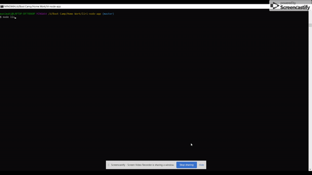
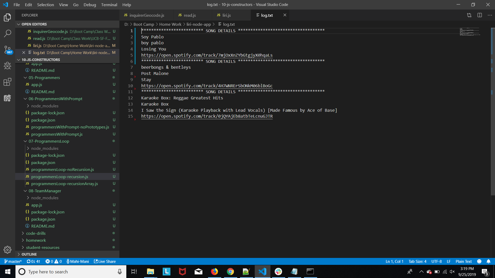
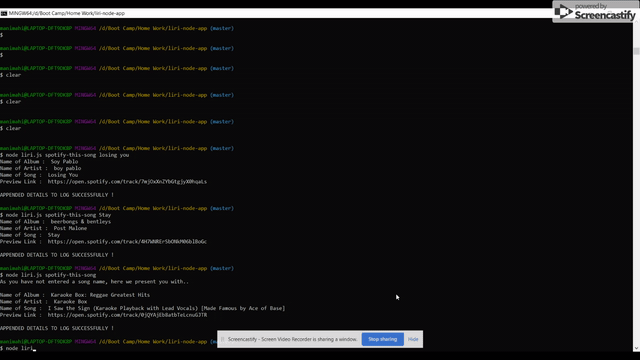
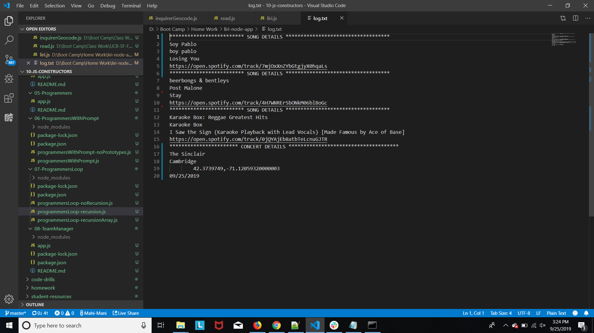
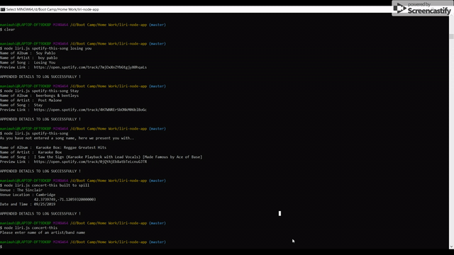
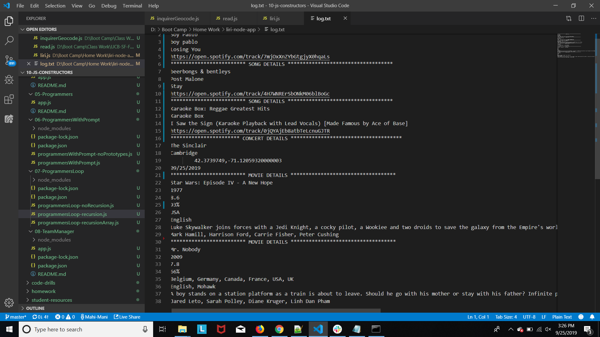
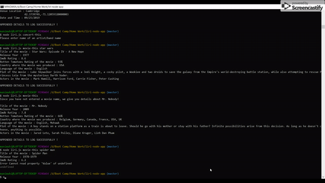
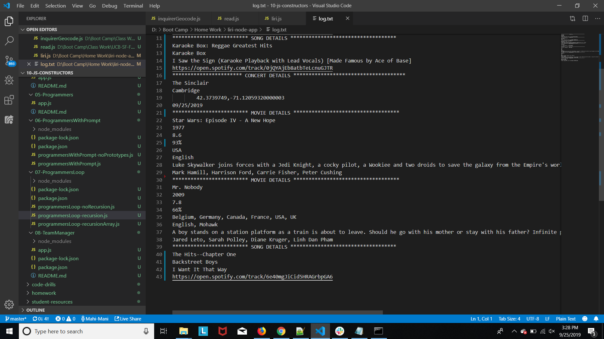

# liri-node-app

## Technologies Used
- Javascript : used to provide interactive effects
- Node : used to run javascript file outside the browser. Supports command line user input. Node is useful is different ways. As
far as this code is concerned, utilised filesystem, axios, moment, spotify api.
- Axios : used to call api and extract datas from them.

## Summary
## LIRI Application. Language Interpretation and Recognition Interface.

## Site pictures and explanation
- Spotify.gif :
`node liri.js spotify-this-song losing you`

```
Output : Gives name of album, artist, song and preview link of song in spotify. 
Output is logged in log.txt file as well.
```

`node liri.js spotify-this-song Stay`

``` 
Output - Gives name of album, artist, song and preview link of song in spotify. 
Output is logged in log.txt file as well.
```

`node liri.js spotify-this-song`

```
Output - Since user did not give any input song to log, default value of "The Sign by Ace of Base" 
song details are displayed. 
Output is logged in log.txt file as well.
```

- logAfterSpotify.png :

All commands' output is logged to log.txt file and the screenshot of it is added below.


- Concert.gif :
`node liri.js concert-this Built to Spill`

```
Output - Gives Venue, venue location, Date and Time in customized format(MM/DD/YYYY). 
Output is logged in log.txt file as well.
```

`node liri.js concert-this`

```
Output - Since user did not give any input, it reminds the user to enter either band/artist name to proceed further. 
This time, output is not logged as user did not provide an input.
```

- logAfterConcert.png :

All commands' output is logged to log.txt file and the screenshot of it is added below. We can see the values are appended to file after spotify output.


- Movie.gif :
`node liri.js movie-this star wars`

```
Output - Gives title of movie, release year, Imdb rating, rotten tomatoes rating, country where the movie was produced, language, plot and actors in the movie. 
Output is logged in log.txt file as well.
```

`node liri.js movie-this`

```
Output - Since user did not give any input, it gives details about the default value "Mr. Nobody". 
The output is logged to log.txt file as well.
```


- logAfterMovie.png :
 
All commands' output is logged to log.txt file and the screenshot of it is added below. We can see the values are appended to file after concert output.


- DoWhatItSays.gif :
`node liri.js do-what-it-says`

```
Output - Gives name of album, artist, song and preview link of song in spotify of "I want it that way" 
since that song name was specified in random.txt. Code reads random.txt file and outputs the 
song name that was read from text file. 
Output is logged in log.txt file as well.
```

- logAfterDoItThatWay.png :

All commands' output is logged to log.txt file and the screenshot of it is added below. We can see the values are appended to file after movie output.




## Code Snippet
```Javascript

    // ****************************************
    // Function that appends data to text file
    // ****************************************
    
    function appendToFile(value){
    fs.appendFile("log.txt","\n"+value,function(err){
        if(err){
            console.log(err);
        }
        console.log("\nAPPENDED DETAILS TO LOG SUCCESSFULLY !");
    });
}

    // ***************************************************************
    // This code snippet is executed when user typed "do-what-it-says"
    // ****************************************************************
 
    if(process.argv[2] === "do-what-it-says"){ 
        // Using filesystem read file random.txt
        fs.readFile("random.txt","utf8",function(err, data){
            if(err){
                console.log(err);
            }
            // Split contents of file using a comma
            var dataArr = data.split(",");
            process.argv[2] = dataArr[0];
            // Assigning the name of song from file to songName
            songName = dataArr[1];
            // Calling spotify function to print song details
            spotify(songName);

        });
    }
```


## Author Links
[LinkedIn](https://www.linkedin.com/in/mahisha-gunasekaran-0a780a88/)

[GitHub](https://github.com/Mahi-Mani)

